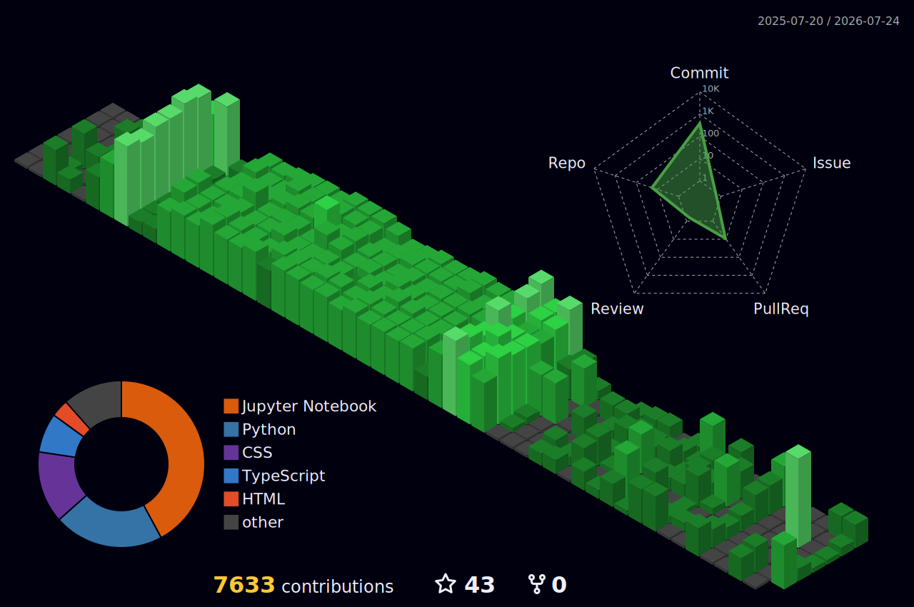

# 💫 About Me:
Hi 👋 I'm FeniksZharovik  I'm a Software Engineer passionate about developing modern, scalable, and high-performance software solutions. I enjoy solving complex problems, writing clean code, and building applications that deliver real value.  💻 Full-Stack Web Development   ⚡ RESTful API Development & System Integration   🛠 Clean Architecture & Software Design Principles   🔒 Security, Performance Optimization & Best Practices   🚀 CI/CD, Git Workflow & Cloud Deployment  I'm always exploring new technologies and continuously improving my skills to build reliable, maintainable, and impactful software.

# 💻 Tech Stack:
                                                                                      
# 📊 GitHub Stats:
 
 

<!-- Proudly created with GPRM ( https://gprm.itsvg.in ) -->

